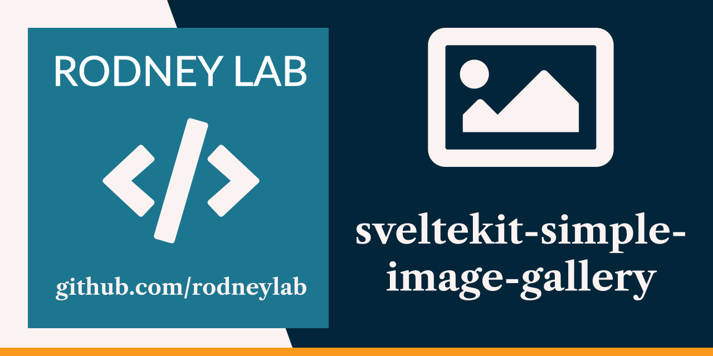

<p align="center">
  <a aria-label="Open Rodney Lab site" href="https://rodneylab.com" rel="nofollow noopener noreferrer">
    
  </a>
</p>
<h1 align="center">
  SvelteKit Simple Image Gallery
</h1>

# sveltekit-simple-image-gallery

[](https://stackblitz.com/github/rodneylab/sveltekit-simple-image-gallery)

Demo code for creating a simple responsive image gallery with Svelte. The code accompanies the <a aria-label="Open Rodney Lab blog post on using vanilla extract with Svelte Kit" href="https://rodneylab.com/simple-svelte-responsive-image-gallery/">post on creating a simple responsive image gallery SvelteKit</a>. If you have any questions, please drop a comment at the bottom of that page.

## Building and previewing the site

If you're seeing this, you've probably already done this step. Congrats!

```bash
git clone https://github.com/rodneylab/sveltekit-simple-image-gallery.git
cd sveltekit-simple-image-gallery
pnpm install # or npm install
pnpm run dev
```

## Building

```bash
pnpm run build
```

> You can preview the built app with `pnpm run preview`, regardless of whether you installed an adapter. This should _not_ be used to serve your app in production.

## Customising for your own images

1. The project includes the raw images in the `src/lib/assets` folder. Add your images there.
2. `src/data/image.json` links the image files names with atl text and titles. Update this manually or generate it based on an existing source for your images.
3. `src/data/generated` has a JavaScript file for each each containing data needed to create the responsive and next-gen image set for each base image. I generated these files automatically using the `generate-responsive-image-data.js` script in the project root directory. You can update it to suite your needs, then run it with `node`. I prefer using vite-node (which will also work with TypeScript projects):

```shell
pnpm add -D vite-node
pnpm vite-node generate-responsive-image-data.js
```

Hope that&rsquo;s clear, but let me know if I can improve the explanation.

Feel free to jump into the [Rodney Lab matrix chat room](https://matrix.to/#/%23rodney:matrix.org).
